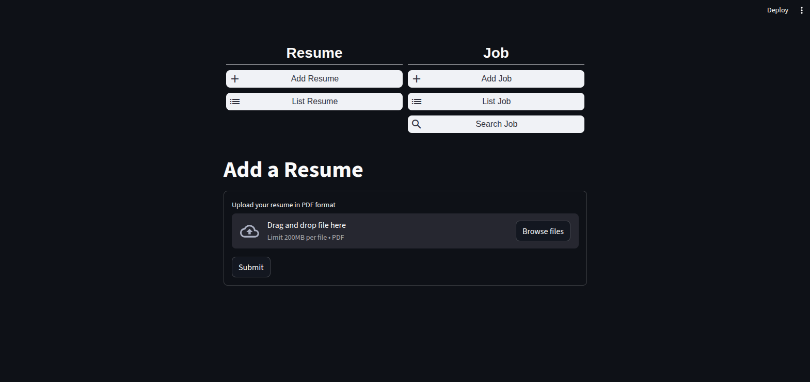

```     _       _       ____                       _        _    ___ 
    | | ___ | |__   / ___| _ __ ___   __ _ _ __| |_     / \  |_ _|
 _  | |/ _ \| '_ \  \___ \| '_ ` _ \ / _` | '__| __|   / _ \  | | 
| |_| | (_) | |_) |  ___) | | | | | | (_| | |  | |_   / ___ \ | | 
 \___/ \___/|_.__/  |____/|_| |_| |_|\__,_|_|   \__| /_/   \_\___|
                                                                  
```

# 🧐 JobSmartAI – AI-Powered Resume Parser & Job Finder

JobSmartAI is an open-source tool that analyzes your resume using local AI (via [Ollama](https://ollama.com)), extracts
your skills, and recommends job listings from platforms like [RemoteOK](https://remoteok.com)
and [Relocate.me](https://relocate.me).\
It runs on a Django backend with a simple Streamlit frontend.

---

## 🚀 Features

- ✅ Upload your resume (PDF)
- ✅ Analyze content using a local Ollama model (e.g. `mistral`)
- ✅ Extract structured information: name, contact, skills, job title, etc.
- ✅ Automatically search for real job listings using your **first detected skill**
- ✅ Live jobs from RemoteOK and Relocate.me
- ✅ Calculate a compatibility score between the uploaded resume and a job listing
- ✅ Automatically generate a tailored cover letter for a selected job
- ✅ Clean UI with Streamlit

---

## 🛠 Tech Stack

- 🔹 Backend: Django + Django REST Framework
- 🔹 Frontend: Streamlit
- 🔹 AI Processing: Ollama + Mistral
- 🔹 Web scraping: `requests`, `BeautifulSoup`

---

## 📁 Folder Structure

```
├── jobsmartai/
│   ├── django_backend/         # Backend APP
│   ├── streamlit_frontend/     # Frontend APP
```

---

## 📸 Demo



🕒 Processing Time Note:
Since Ollama runs locally, resume analysis may take **up to 3 minutes** depending on your system specs (especially if you don’t have a GPU). This step uses a full language model to extract resume data.

---

## 📦 Installation

### 1. Clone the project

```bash
git clone https://github.com/mahmoudbarzegar/jobsmartai.git
cd jobsmartai
```

### 2. Create virtual environment and install dependencies

```bash
python3 -m venv venv
source venv/bin/activate
pip install -r requirements.txt
```

---

## ⚙️ Requirements

- Python 3.9+
- [Ollama](https://ollama.com/) installed and running locally\
  → Must be running a supported LLM like `mistral`:

```bash
ollama run mistral
```

---

## 🧠 How It Works

1. Upload a PDF resume via the Streamlit frontend
2. Resume is parsed and passed to the Ollama API (running locally)
3. AI extracts fields like:
    - Full name
    - Email / phone
    - Skills (as list)
    - Experience
    - Education
4. First extracted skill is used to search jobs from:
    - RemoteOK (via API)
    - Relocate.me (via scraping)
5. Results are shown in UI
6. Compute a compatibility score between a resume and each job (0–100) using Ollama.
7. Automatically generate a tailored cover letter for a selected job.
8. Display parsed resume, job matches, scores, and cover letters in the Streamlit UI

---

## 🚀 Run the App

### 1. Start Django Backend

```bash
cd backend
python3 manage.py runserver
```

### 2. Start Streamlit Frontend

```bash
cd frontend
streamlit run app.py
```

Then open [http://localhost:8501](http://localhost:8501) in your browser.

---

## 🔒 Notes

- Make sure **Ollama is installed and running** locally before uploading a resume.
- If using Docker or a VM, ensure the correct IP is used in backend settings to connect to Ollama (
  `http://127.0.0.1:11434`).
- `robots.txt` of job sources is respected. Please credit RemoteOK and Relocate.me when reusing their content.

---

## 📊 Future Plans

-

---

## 🤝 Contributing

Pull requests and ideas are welcome. Open an issue to discuss your feature or bug fix.

---

## 📜 License

MIT License © [Mahmoud Barzegar](https://github.com/mahmoudbarzegar)

---

## 🌍 Credits

- [Ollama](https://ollama.com)
- [RemoteOK](https://remoteok.com)
- [Relocate.me](https://relocate.me)